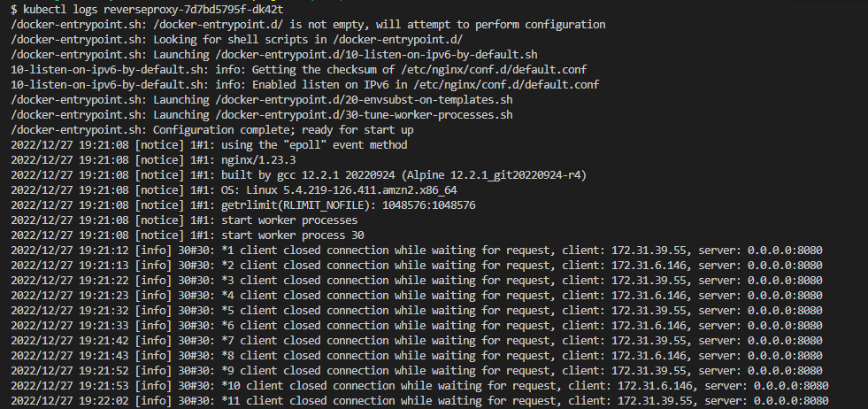

# Udacity

- In this project you will:
Refactor the monolith application to microservices
Set up each microservice to be run in its own Docker container
Set up a Travis CI pipeline to push images to Dockerhub
Deploy the Dockerhub images to the Kubernetes cluster

### Monolith to Microservices Project

# Screenshots

## Deployment Pipeline

- DockerHub
  

- Travis
  

- Travis Build
  

## Kubernetes

- Running Pods  
  

- Kubernetes Describe services
  
  
  
  
  

- horizontal scaling
  

- API logs
  

- Reverseproxy Logs
  
  
#
